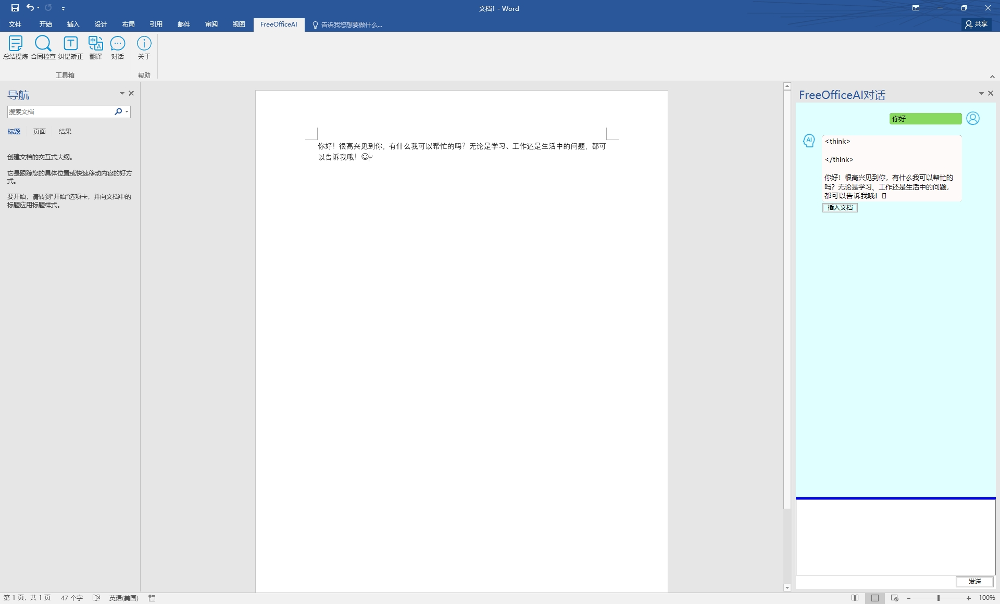

# FreeOfficeAI
Free office AI tool   
免费的Office AI工具

## 更新日志：
1，重构代码结构  
2，UI优化  
3，支持连续对话  
4，优化异常处理  
5，增加大模型配置  

## 使用说明：
1，通过本地Ollama部署大模型，在“FreeOfficeAI.Core”→“OllamaApi”中配置相关API  
2，通过VSTO集成到Word和Excel中  
3，Word支持总结提炼、合同检查、纠错矫正、翻译、对话功能  
4，Excel支持对话和公式(通过AI编写VBA自动处理文档)  

更多功能持续更新中...

## 功能演示：

## 打包与安装
1，项目clone到本地后，使用VS打开项目文件  
2，首先“生成解决方案”，等待编译完成  
3，右键”Setup“——“重新生成”  
4，在“Setup”目录下找到.msi后缀的安装文件，双击安装即可  
5，安装程序设置了自动覆盖低版本，升版时，更改“Setup”中的版本信息以及其他项目下“AssemblyInfo”中的版本信息

## 联系方式：
技术交流、学习、优化、BUG修正等可联系：  
邮箱：844309084@qq.com
